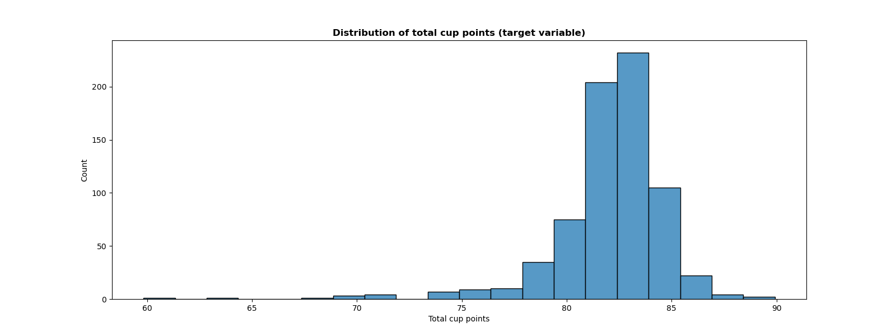
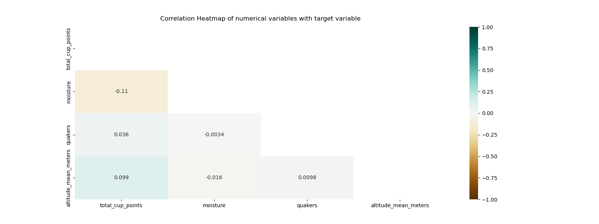

```{r setup, include=FALSE}
knitr::opts_chunk$set(echo = TRUE)
library(knitr)
library(kableExtra)
library(tidyverse)
```

## Summary

In this analysis, we attempt to find a supervised machine learning model which uses the features of the Coffee Quality Dataset, collected by the Coffee Quality Institute [@mock] in January 2018, to predict the quality of a cup of Arabica coffee.

After exploring regression based models, Ridge Regression and Random Forest Regressor, our analysis deviated to re-processing our data and exploring classification models. As you will see in our analysis below, predicting a continuous target variable proved quite difficult with many nonlinear features, and was not very interpretable in a real sense of what we were trying to predict. Broadening the target variable and transforming it into classes: "Good" and "Poor", based on a threshold at the median, helped with these issues.

Our final model, using Random Forest Classification, performed averagely on an unseen test data set, with an ROC score of 0.67. We recommend continuing to study to improve this prediction model before it is put to any use, as incorrectly classifying the quality of coffee could have a large economic impact, and have described how one might do that at the end of our analysis.

## Introduction

A truly global industry, coffee is one of the most consumed beverages in the world. Its very large economic impact continues to grow year over year, despite challenges that have negatively stunted other industries such as the COVID-19 pandemic. In the US alone, the coffee industry represents approximately 1.6% of GDP, and 1.7 million jobs, with 76% of Americans reporting that they consume coffee in 2015. While these numbers seem large, it begs the question: who is actually benefiting from this? [@NCA] Notoriously the producers of coffee have seemed to gain the least, often coming from economically disadvantaged places, dealing with fair trade and sustainability issues [@diepenbrock_2015].

In our analysis we ask if we can create a model that can accurately predict the quality of coffee. If it can do this effectively, we could see it being helpful to coffee producers. While we acknowledge that the quality of coffee is not all that makes it successful, accessibility of this information could enable the actual producers of coffee to be able to differentiate and fine tune their crop, and validate their own quality of product without additional barriers like the cost of a national board certification.

## Methods

### Data

The data was retrieved from tidytuesday [@mock], courtesy of James LeDoux, a Data Scientist at Buzzfeed. The data is collected on Arabica coffee beans from across the world and professionally rated on a 0-100 scale based on factors like acidity, sweetness, fragrance, balance, etc. The dataset also contains information about coffee bean origin country, harvesting and grading date, colour, defects, processing and packaging details.

Further cleaning was performed on this dataset to remove all variables except `total_cup_points`, our target variable, and our feature variables: `country_of_origin`, `region`, `harvest_year`, `processing_method`, `moisture`, `category_one_defects`, `quakers`, `color`, `category_two_defects`, and `altitude_mean_meters`. The original variable `region` was transformed and re-organized to reflect the industry recognized coffee growing-regions: East Africa and the Arabian Peninsula, Southeast Asia and the Pacific, and Latin America [@starbucks_coffee_co]. Additional cleaning was performed to remove erroneous outliers from the data.

### Analysis

#### Exploratory Data Analysis

We performed analysis by exploring the relationship between the numeric features and the target variable, `total_cup_points` . We will use the following visualizations: a histogram showing the distribution of `total_cup_points` , and a heatmap of the correlation between the numeric features and `total_cup_points`.

```{r heatmap, echo=FALSE, fig.cap="Figure 1. Distibution of Target variable, total_cup_points", out.width = '100%'}

```

In the above plot, we observed that the `total_cup_points` (target variable) have a left-skewed distribution. The distribution ranges from 60 to 90. Most of the values are between 80 to 85. The predictive model will learn the target data in this range.

```{r histogram, echo=FALSE, fig.cap="Figure 2. Correlation heatmap of numeric features against target", out.width = '100%'}

```

In the above correlation matrix, we observed that category two defects feature has the highest absolute correlation with `total_cup_points` . The second highest correlation is with category one defects followed by moisture. This feature will show up later during our modelling process as one of the top few important features. All features except quakers feature have a negative correlation with the target variable. Altitude mean meters feature seems to have a weak correlation to the target although this feature will later on prove to still be useful in classification modelling.

#### Machine Learning Models

To address the primary goal of predicting coffee quality, we carried out machine learning regression models [@scikit-learn] such as Ridge Regression and Random Forest Regression on certain significant features as shown in the EDA analysis above. We chose regression methods as the 'target' variable for coffee rating was a continuous, numeric variable. We used standard scaling to transform numerical features and one-hot encoding to transform categorical features in the dataset. To find the model that best predicted the coffee quality, we conducted five-fold cross validation on both models and calculated the average validation score. We then performed hyperparameter optimization on the best model.

## Results and Discussion

Below are the cross-validation scores from the regression models:

```{r, echo = FALSE, message=FALSE, warning=FALSE}
col <- read_csv("../results/model_comparison.csv")
names(col)[1] <- " "
  
kable(col,
      caption = "**Table 2.** Table 1. Regression and Classification Cross-validation Results.") %>%
  kable_styling(latex_options="scale_down")
```

As seen from the results of cross-validation, both Ridge (R\^2 score -0.065) and Random Forest Regression models (R\^2 score 0.169) did not perform very well on our dataset. The Random Forest Regression model had a higher validation score than the Ridge model, so we picked this model for hyperparameter optimization via the random search algorithm. This improved the R\^2 score to 0.25.

```{r feature-imp rfr, echo=FALSE, fig.cap="Figure 1. Random Forest Regressor Feature Importances", out.width = '70%'}

```

Here, we display the important features from the best model from our random search in the above barplot. Altitude, moisture and Mexico as Country of Origin were the top 3 important features.

Since the regression models produced R\^2 scores of below 0.5, we also applied a Random Forest Classification [@scikit-learn] model to the training data with some additional preprocessing. First, we separated the numeric target variable `total_cup_points` into two different classes: "Good" and "Poor" based on a median threshold. The former being scores higher than median score, and the latter being scores lower than median score (which is 82 out of 100).

Referring back to Table 1 of results, we can see that the Random Forest Classifier model performance is acceptable, with cross-validation ROC score of 0.72. This model's performance is better than the regression models as the test score on the test set was about 0.67.

```{r feature-imp rfc, echo=FALSE, fig.cap="Figure 1. Random Forest Classifier Feature Importances", out.width = '70%'}

```

Interestingly, the top 5 important features in this classifier included 3 similar features shown from the Random Forest Regressor model: altitude, moisture and Mexico made it to the top 5 again. However, these results did not correlate to what we see from our initial EDA analysis above.

## Critique, Limitations and Future Improvements

We faced several limitations in our analysis such as small dataset size (approximately thousand rows) and limited types of features available for feature engineering and modelling. In addition, many features had to be discarded due to their lack of relevance to our models. For example, features such as aroma, flavour, aftertaste, acidity, body, balance, uniformity, or sweetness were all discarded as they were just individual contributors to the calculation of the overall rating or the target variable.

Our model analysis may be improved with the inclusion of more relevant predictive features or more data. We could also try out adding more polynomial features and perform feature engineering such as combining features together to form new ones. More data cleaning methods could also be applied, such as inspection and removal of outliers, as these can affect regression model performance significantly. Additionally, we should also try out more classification models (Naive Bayes, Logistic Regression, etc.) as we see the advantage of using classification over regression models.

## References
